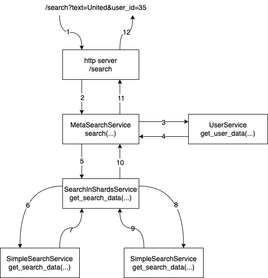

# Заготовка для ДЗ 3

В этом репозитории находится код очень простого и совершенно неэффективного сервиса поиска по документам на основе 
профиля пользователя. По структуре он напоминает то, как выглядит поиск у Google или Яндекс, однако только по структуре, 
потому что сейчас это монолит и вообще пример довольно искуственный.

## Что это такое?

Сервис представляет из себя один http сервер, описанный в `src/search/metasearch/http.py` и запускаемый из 
`src/search/main.py`. У сервиса всего одна ручка с двумя параметрами — 
`/search?text=sometext&user_id=10`. В ответе придет список документов, отранжированный каким-то 
примитивным образом (код можно почитать в `src/search/search`). Пользователи лежат в файле `data/users.csv`. Остальные 
файлы это документы (заголовки новостных статей и их текст). Подробнее про данные новостей можно прочитать 
[тут](https://www.kaggle.com/amananandrai/ag-news-classification-dataset?select=train.csv). Чтобы поиск действительно 
мог быть основан на пользовательском профиле, в этот датасет подмешаны случайно сгенерированные поля про пользователей 
(кроме возраста, он выставлен на основе категории новости вручную).

Каждый запрос отправляется в "метапоиск" (`MetaSearchService`), который ходит за полями пользователя и за его регионом 
в соответствующие сервисы, после чего идет в поиск. Поиск может быть как над одним файлом, так и над несколькими шардами. 
Здесь уже реализован поиск над несколькими шардами, которые вам надо будет превратить в отдельные сервисы. Сейчас граф 
запроса выглядит следующим образом:



## Как скачать и протестировать

**Перед установкой убедитесь, что у вас установлен Git LFS: https://git-lfs.github.com**

Скачаем репозиторий и соберем всё необходимое:
```
git clone git@gitlab.com:NanoBjorn/hse-cloud-2020-hw-3-microservices.git  # эта команда так же должна скачать данные в папку data, если на компьютере установлен git lfs
cd hse-cloud-2020-hw-3-microservices.git
docker-compose build
```

Теперь можно запустить интеграционные тесты, которые дождутся работающего поиска и сделают туда всего один запрос:
```
docker-compose up -d search
docker-compose run integration_tests
```

В папке `src/search` находится весь сервис поиска. Запускается он с помощью  `src/search/main.py` скрипта. Можете 
пройтись по всему графу запроса и почитать код и методы, которые отвечают на запросы. Там всё вполне прямолинейно и 
понятно. Каждый сервис берет данные из заранее заготовленного CSV файла, путь до которых указан в 
`src/search/settings.py`.

В папке `src/tests` находятся интеграционные тесты, сейчас там всего один тест на работоспособность всей конструкции. 
Эти тесты делают сырые запросы в сервис поиска.

### Интеграционные тесты
Интеграционные тесты проще запускать с помощью docker-compose.
```
docker-compose up -d search && docker-compose run integration_tests && docker-compose down
```

Чтобы при изменениях кода тестов не пересобирать контейнер, можно раскомментировать вольюмы внутри `docker-compose.yml`.  
